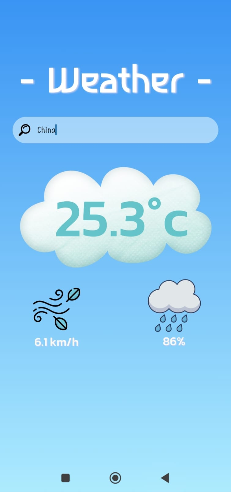
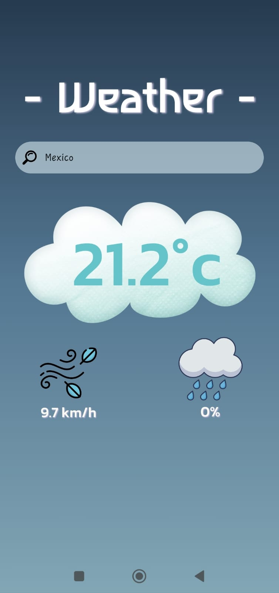

# Weather App

A clean and small weather application built with React Native and Expo. This project fetches real-time weather data from the WeatherAPI and displays it in a user-friendly interface with a dynamic background that adapts to the time of day.

## Screenshot

*A preview of the application in action. The background gradient changes based on day/night conditions.*





---

## Key Features

* **Real-Time Weather Data:** Fetches and displays current weather information for any searched city.
* **Dynamic Background:** The background is a linear gradient that automatically changes to reflect whether it is currently day or night at the searched location.
* **Key Weather Metrics:** Displays essential information including the current temperature in Celsius, wind speed in km/h, and the daily chance of rain as a percentage.
* **Class-Based Component:** Built using React's class component architecture to manage the application's state and logic.
* **Secure API Key Handling:** The API key is securely loaded from environment variables to prevent it from being exposed in the source code.

---

## Technologies Used

* **Framework:** React Native (with Expo)
* **Language:** JavaScript
* **API:** [WeatherAPI.com](https://www.weatherapi.com/)
* **Core Libraries:**
    * `expo-linear-gradient` for the dynamic UI background.
    * `react-native-dotenv` to manage environment variables.
* **HTTP Requests:** Makes asynchronous API calls using `XMLHttpRequest`.

---

## Getting Started

To get a local copy up and running, follow these simple steps.

1.  **Clone the repository:**
    ```bash
    git clone [https://github.com/your-username/Weather-App.git](https://github.com/your-username/Weather-App.git)
    ```

2.  **Navigate to the project directory:**
    ```bash
    cd Weather-App
    ```

3.  **Install the dependencies:**
    ```bash
    npm install
    ```
    *(or `yarn install` if you use Yarn)*

4.  **Set up your environment variables:**
    * Create a file named `.env` in the project root.
    * Inside this file, add your API key from WeatherAPI.com. The variable name must match the one used in the code:
        ```
        WEATHER_API_KEY="YOUR_SECRET_API_KEY_HERE"
        ```

5.  **Start the application:**
    ```bash
    npx expo start
    ```
    The Metro Bundler will open. Scan the QR code with the Expo Go app on your phone to run it.